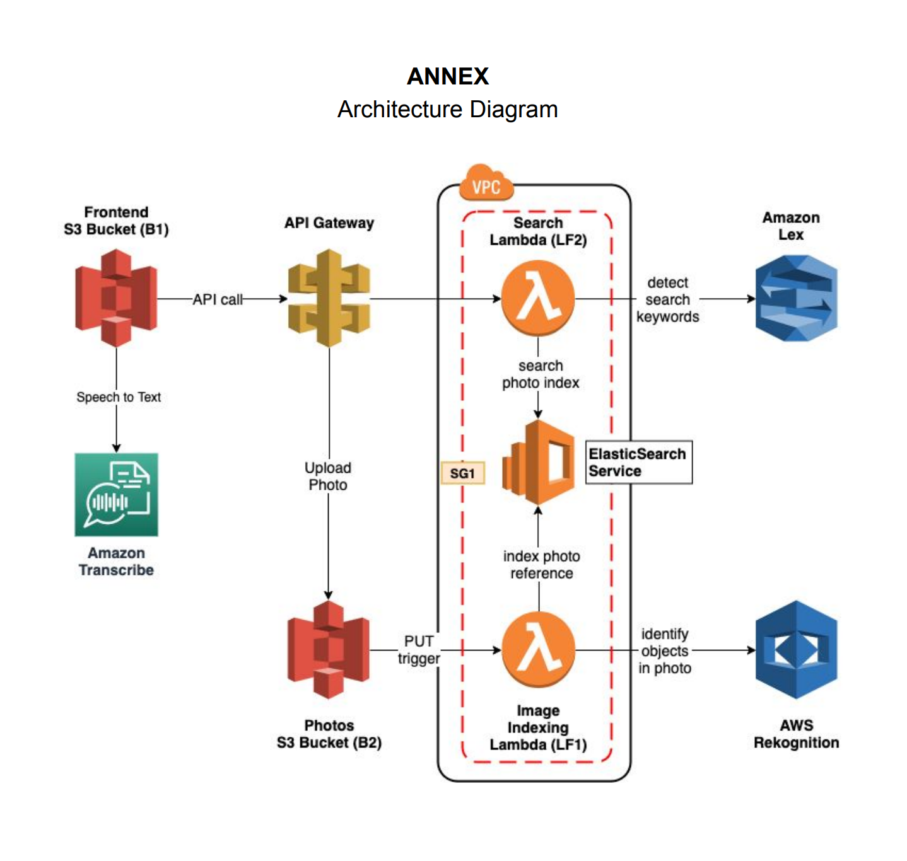

# Photo Album Web Application

Build a photo album web application that can be searched using natural language through both text and voice.

### Outline:

1. Security Group is used to prevent unauthorized interent access.
2. S3 bucket is used to store the photos. Whenever the users upload the photos, it triggers the lambda function that detect labels in the image using Rekognition service. Then, it stores this information in the ElasticSearch.
3. If the user search photos, it triggers lambda function that sends the search query to Amazon Lex bot to catch the intent and extract the keywords. Then, it searches the best fit photos using the ElasticSearch, and return the photos accordingly.
4. User can also use voice rather than text to perform the search. Amazon Transcribe service is used.
5. CloudFormation and CodePipeline is created to build and deploy above services.

### Workflow

1. User search photo via text or voice.
2. Step 1 invokes lambda function that detect search keywords via Amazon Lex service, get the best fit photo id via elastic search, and finally get the best fit photos in S3 bucket.
3. User upload photo. It would upload photo into the S3 bucket.
4. The S3 bucket triggers lambda function when the image is uploaded. It identify the objects in photos by using AWS Rekognition service, and store these information in ElasticSearch.

### CloudFormation

Using the CloudFormation Template, you can stand up the entire functional stack for this service.
Once a new commit is pushed, the CodePipeline automatically build and deploy the code to the corresponding AWS infrastructure.

### Architecture Image

